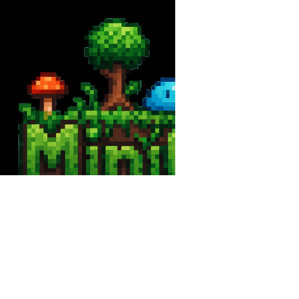

<div align="center">

<picture>
  <source media="(prefers-color-scheme: light)" srcset="/docs/logo_tiny_light.svg">
  
</picture>

MiniGen is for the exploration of the agentic AI world powered by [openai-python](https://github.com/openai/openai-python)

<h3>

[Homepage](https://github.com/devdezzies/minigen) | [Documentation](https://d-ev.space/)

</h3>

</div>


MiniGen is a framework for building agents using OpenAI compatibility APIs. 
You can use Gemini, Groq, Claude, Ollama, or other LLM providers that support OpenAI API compatibility. This framework provides essential wrappers for building an agent directly with the OpenAI API. This framework provides you with simplicity and transparency by explicitly showing the agent's planning steps.

## Tool Calling 
In tool calling, you no longer have to write the boilerplate JSON code to define your tools. Just define the function and add a decorator that will translate everything for you. 

```python 
from minigen import tool 

@tool(description="Convert lbs to kg")
def lbs_to_kg(lbs): 
    return lbs * 0.45359237
```

This decorator will extend your function by adding an additional method for JSON creation. 

```
{
    'type': 'function',
    'function': {'name': 'lbs_to_kg',
    'description': 'Convert lbs to kg',
    'parameters': {'type': 'object',
        'properties': {'lbs': {'type': ('string',)}},
        'required': ['lbs']},
    'strict': True
    }
}
```

# AgentSession 
Another important part is session context. This contains information that the model has to know, including user query, assistant output, and tool calls. Let's try to combine the tool calling with a session. 

```python
from openai import OpenAI 
from minigen import tool, AgentSession

client = OpenAI()

@tool(description="Convert lbs to kg")
def lbs_to_kg(lbs): 
    return lbs * 0.45359237

with AgentSession(client=client, tools=[add]) as session: 
    session.user("How much is 20 lbs in kg?")
    result = session.run() 
    print("Answer:", result)
```

You can also add system prompt to the session. Just add `session.assistant("You are a helpful assistant")`

# Primitives
There are two core building-blocks for building an agent in MiniGen. We define them as Chain and Router. These are types of decomposing AI tasks into individual steps to complete the overall task. These blocks can be combined to form your own AI system.

## Chain (prompt chaining)
The concept of prompt chaining is basically executing small tasks sequentially. The output of one step is used as the input for the next step. This is the foundation of breaking down a complex task into a series of smaller, manageable steps.

```python 
from minigen import Agent, Chain 

agent = Agent() 

research_chain = Chain(agent=agent, verbose=True) 

research_chain
    .add_step("Generate a one-paragraph technical explanation of {input}")
    .add_step("Take the following technical explanation and simplify it for a 5th grader: {input}")

explanation = research_chain.run("Double-slit experiment")
print(explanation)
```

## Router (if-statement)
This is a special kind of chain link that directs the conversation to one of several possible next steps. This uses the LLM's reasoning to classify an input and decide where it should go next. 

```python 
from minigen import Agent, Router 
from enum import Enum 
from pydantic import BaseModel, Field

# Define the possible routes with an Enum
class QueryCategory(Enum): 
    MATH = "math" 
    CREATIVE_WRITING = "creative_writing" 
    UNKNOWN = "unknown" 

# Create a Pydantic model for the router's decision 
class RouteChoice(BaseModel) 
    route: QueryCategory = Field(description="The best category for the user's input")

# Create an agent 
agent = Agent()

# Create chains for each route 
math_chain = Chain(agent=agent, verbose=True).add_step("Solve this math problem: {input}") 
writing_chain = Chain(agent=agent, verbose=True).add_step("Write a short story about: {input}")
unknown_chain = Chain(agent=agent, verbose=True).add_step("Explain that you can't answer this: {input}")

# Create and configure a router 
router = Router(
    agent=agent, 
    route_model=RouteChoice, 
    routing_prompt_template="Classify the following user query into one of the available categories: {input}"
)

router.add_route(QueryCategory.MATH, math_chain)
router.add_route(QueryCategory.CREATIVE_WRITING, writing)
router.add_route(QueryCategory.UNKNOWN, unknown_chain)

# run the router 
router.run("What is 1 + 1?")
```